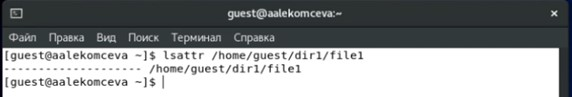
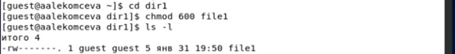
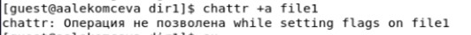
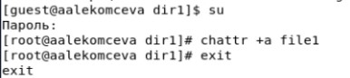
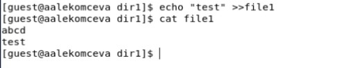
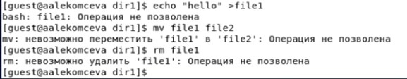
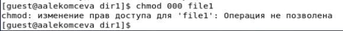
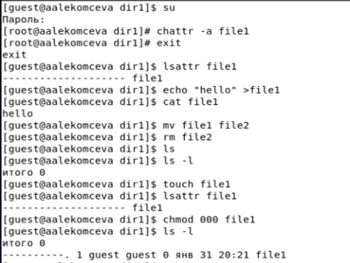
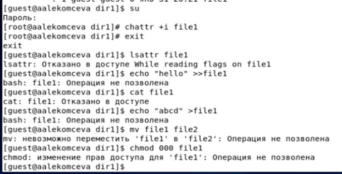

---
# Front matter
lang: ru-RU
title: 'Отчёт'
subtitle: 'по лабораторной работе 4'
author: 'Лекомцнва Алёна'

# Formatting
toc-title: 'Содержание'
toc: true # Table of contents
toc_depth: 2
lof: true # List of figures
lot: true # List of tables
fontsize: 12pt
linestretch: 1.5
papersize: a4paper
documentclass: scrreprt
polyglossia-lang: russian
polyglossia-otherlangs: english
mainfont: PT Serif
romanfont: PT Serif
sansfont: PT Sans
monofont: PT Mono
mainfontoptions: Ligatures=TeX
romanfontoptions: Ligatures=TeX
sansfontoptions: Ligatures=TeX,Scale=MatchLowercase
monofontoptions: Scale=MatchLowercase
indent: true
pdf-engine: lualatex
header-includes:
  - \linepenalty=10 # the penalty added to the badness of each line within a paragraph (no associated penalty node) Increasing the value makes tex try to have fewer lines in the paragraph.
  - \interlinepenalty=0 # value of the penalty (node) added after each line of a paragraph.
  - \hyphenpenalty=50 # the penalty for line breaking at an automatically inserted hyphen
  - \exhyphenpenalty=50 # the penalty for line breaking at an explicit hyphen
  - \binoppenalty=700 # the penalty for breaking a line at a binary operator
  - \relpenalty=500 # the penalty for breaking a line at a relation
  - \clubpenalty=150 # extra penalty for breaking after first line of a paragraph
  - \widowpenalty=150 # extra penalty for breaking before last line of a paragraph
  - \displaywidowpenalty=50 # extra penalty for breaking before last line before a display math
  - \brokenpenalty=100 # extra penalty for page breaking after a hyphenated line
  - \predisplaypenalty=10000 # penalty for breaking before a display
  - \postdisplaypenalty=0 # penalty for breaking after a display
  - \floatingpenalty = 20000 # penalty for splitting an insertion (can only be split footnote in standard LaTeX)
  - \raggedbottom # or \flushbottom
  - \usepackage{float} # keep figures where there are in the text
  - \floatplacement{figure}{H} # keep figures where there are in the text
---

# Цель работы

Получение практических навыков работы в консоли с расширенными атрибутами файлов.

# Задание

Лабораторная работа подразумевает получение практических навыков работы в консоли с расширенными атрибутами файлов.

# Выполнение лабораторной работы

1.	От имени пользователя guest командой _lsattr_ определяю расширенные атрибуты файла /home/guest/dir1/file1. (рис.1).

   { #fig:001 width=60% }

2. Перехожу в директорию dir1, чтобы в дальнейшем не прописывать весь путь к файлу file1. Устанавливаю командой _chmod 600 file1_ на file1 права, разрешающие чтение и запись для владельца файла, в данном случае для пользователя guest. И проверяю правильность установленных прав командой _ls -l_. (рис.2).

   { #fig:002 width=60% }

3. Пробую установить на файл file1 расширенный атрибут "a" от имени пользователя guest командой _chattr +a /home/guest/dir1/file1_. Операция не удалась так как у пользователя guest нет прав на изменение атрибутов данного файла. (рис.3).

   { #fig:003 width=60% }

4. Повышаю свои права с помощью команды _su_. Снова пробую установить расширенный атрибут «a» на файл file1. (рис.4).

   { #fig:004 width=60% }

5. От пользователя guest проверяю правильность установления атрибута командой _lsattr_. Атрибут действительно был установлен. (рис.5).

   { #fig:005 width=60% }

6.	Выполняю дозапись в файл file1 слова «test» командой _echo “test” >> file1_. После этого выполняю чтение файла командой _cat_. Тем самым убеждаюсь, что слово было успешно записано в файл. (рис.6).

   { #fig:006 width=60% }

7.	Пробую стереть имеющуюся в файле информацию командой _echo "hello" >file1_. В ответ получаю отказ от выполнения операции. Далее пробую переименовать файл file1 в file2 и удалить файл. Также получаю отказ. (рис.7).

   { #fig:007 width=60% }

8.	Пробую с помощью команды _chmod 000 file1_ установить на файл file1 права, запрещающие чтение и запись для владельца файла. Снова получаю отказ от выполнения операции. (рис.8).

   { #fig:008 width=60% }

9.	Снимаю расширенный атрибут «a» с файла file1 от имени суперпользователя командой _chattr -a /home/guest/dir1/file1_ и пытаюсь повторить операции, которые ранее не удавалось выполнить (удалить информацию в файле, переименовать файл, удалить файл, установить права на файл). Без атрибута «a» все операции были выполнены. (рис.9).

   { #fig:009 width=60% }

10. Повторяю все действия по шагам, заменив атрибут «a» атрибутом «i». С атрибутом «i», в отличии от атрибута «a», просмотреть расширенные атрибуты файла не удалось, также как и дозаписать информацию в файл и прочесть файл. Остальные операции также как и с атрибутом «a» не были выполнены. (рис.10).

   { #fig:010 width=60% }

# Выводы

Я получила практические навыки работы в консоли с расширенными атрибутами файлов, опробовав действие расширенных атрибутов «а» и «i» на практике. 
